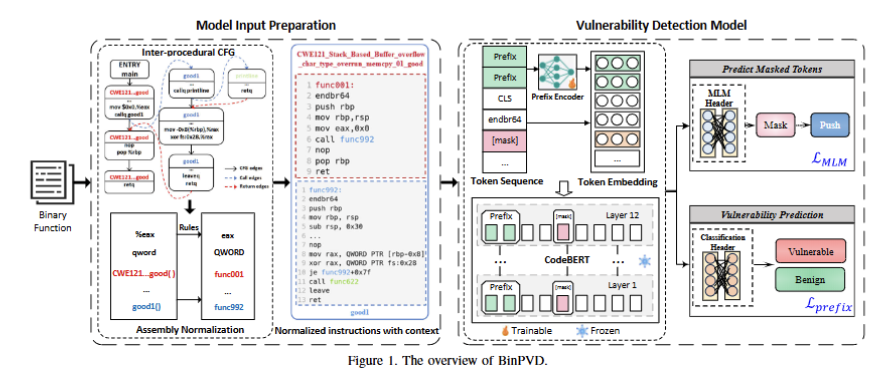

# BinPVD: Parameter Efficient Fine-Tuning for Binary Code Vulnerability Detection

Deep learning (DL)-based vulnerability detection has largely focused on source code, while detecting vulnerabilities directly in binary code remains challenging because assembly instructions are sensitive to compiler optimizations and often lack sufficient context. To address these challenges, we propose BinPVD, a parameter-efficient approach that enriches binary functions with callee context and normalizes their assembly instructions before tokenization. BinPVD adapts a pretrained CodeBERT model through masked language modeling and prefix-tuning, keeping the backbone frozen while learning lightweight task-specific parameters for vulnerability prediction. Experiments on the Juliet Test Suite for C/C++ across four compiler optimization levels show that BinPVD achieves 98.26% accuracy and a 96.72% F1 score, outperforming baseline methods by average margins of 11.65 and 9.97 percentage points, respectively, while improving training efficiency and robustness to compilation variations.

## Design of BinPVD



# Dataset

To evaluate BinPVD, we construct a binary vulnerability dataset from the [Juliet Test Suite for C/C++](https://zenodo.org/records/4701387), a NIST SARD benchmark containing labeled examples across diverse CWE categories. Our dataset construction pipeline consists of the following stages:

1. **Multi-Configuration Compilation**: We compile the Juliet source code with GCC 11.2 at four optimization levels (O0, O1, O2, and O3). The `-g` flag preserves symbol information to support accurate function identification. These configurations allow us to evaluate robustness to compiler-induced changes in binary code.
2. **Assembly Extraction and Context Enrichment**: We use IDA Pro to recover binary functions and their control-flow graphs, then extract assembly instruction sequences. For each call instruction, we incorporate the corresponding callee’s instructions to provide additional context for vulnerability detection.
3. **Instruction Normalization and Tokenization**: We standardize function names, operands, memory references, and other variable instruction details while retaining vulnerability-relevant semantics. A byte-pair encoding (BPE) tokenizer trained on the assembly corpus converts the normalized instructions into model inputs.
4. **Labeling and Splitting**: Functions labeled *bad* in Juliet are treated as vulnerable (`1`), while *good* functions are treated as benign (`0`). Across the four optimization levels, the dataset contains 670,614 function samples: 173,836 vulnerable and 496,778 benign. We split the data into training, validation, and test sets at a ratio of 8:1:1.

# Source Code

## Step 1: Train and Validate BinPVD

```
python -m binpvd.train --[parameter]...
```

## Step 2: Evaluate Across Optimization Levels

```
python -m binpvd.evaluate --experiment_dir <run-directory>
```
